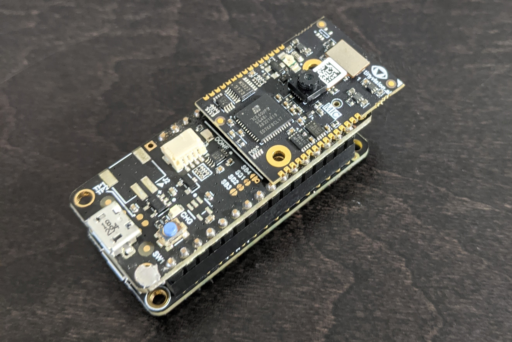

# Drone Guided Landing



This project is to developed a computer-vision guided drone landing algorithm.  See the (Autonomous Drone Landing)[https://hackster.io] project on Hackster for a high-level description

## Programming the FPGA

The pre-built FPGA image can be found in the `fpga` folder.  To program the FPGA using the developer kit, set the DIP switches as follows:

| Functionality | SW1-6	| SW1-7	| SW1-8	| Description |
| :---:         | ---:  |  ---: | ---:  |--- |
| Flash         | On 	| On   	| Off   | FTDI connected to FPGA flash |

Create a new project in the Radiant programmer and select the iCE40UP5K device from the iCE40 UltraPlus family.

Use the following SPI Flash Options:

* Family: SPI Serial Flash
* Vendor: WinBond
* Device: W25x40CL
* Package: 8-pad USON

## Programming the microcontroller

Open the `sketch/land_drone.ino` sketch in the Arduion IDE and upload
to the Feather board.

The Adafruit website has detail instructions for using the Arduino IDE
with the Feather M4 Express, see: [Arduino IDE
Setup](https://learn.adafruit.com/adafruit-feather-m4-express-atsamd51/setup)

https://1drv.ms/u/s!AjkYZezDnHDlgb0-dIvVFgjxMRrehQ?e=o8lfS8

## CNN Quantization

The quantization used is a little simpler than what Tensorflow Lite provides.  The `calibrate.py` program in the `scripts` folder can be used to calibrate the model.  Calibration annotates the model with activation ranges based on test data.

After calibration, quantize the model with the following command:
```
bin\tflite_quantize -symmetric -log_scale -bias16 land-fcn-calibrated.tflite land-fcn-quant-slb16.tflite > land-fcn-quant-slb16.yaml
```

The program reads the calibrated model, does the quantization and outputs the model in Tensorflow Lite format as well as a readable YAML format.  I use the Tensorflow Lite model for testing and evaluation.  However, since I've hand-coded my neural network code for this project, I use the YAML file to get the weights I need in my C code.  I've extracted and stored the weights in `sketch\wts.h` file.  The actual inference code is in `sketch\gndnet.cpp`.
